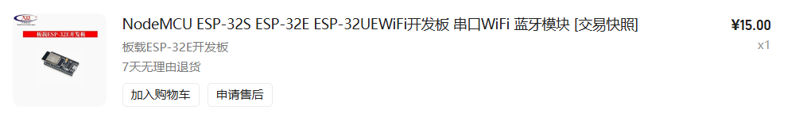

# Kai Sound Local

Version: `1.0.0-local`

Kai Sound Local 是一个本地局域网版本的 ESP32 小喇叭项目。网页通过 PHP HTTP 接口发布 MQTT 命令，ESP32 订阅命令后通过 MAX98357A I2S 功放播放网络 MP3/WAV 音频。

## 功能

- ESP32 连接 WiFi 和 MQTT Broker。
- 本地网页发送播放 URL、暂停、停止、音量、测试音命令。
- 支持播放 `http://` 直链 MP3/WAV。
- 提供本地测试音，用于排查 I2S 接线和功放问题。
- 页面只负责发送命令，不依赖设备在线状态。

## 运行环境

本地运行需要：

- PHP `8.0+`
- Composer
- Mosquitto MQTT Broker
- Arduino IDE 或 Arduino CLI
- ESP32 Arduino board package

PHP 依赖通过 Composer 安装：

```powershell
cd D:\project\sound\php-server
composer install
```

Arduino 依赖库：

- PubSubClient
- ArduinoJson
- ESP8266Audio

## 硬件推荐

以下图片是本项目使用的硬件参考：




推荐硬件：

- ESP32 开发板
- MAX98357A I2S 功放模块
- 4Ω/8Ω 喇叭
- 杜邦线

## 接线说明

固件默认使用这 3 个 ESP32 GPIO 输出 I2S：

| ESP32 引脚 | MAX98357A 引脚 | 说明 |
| --- | --- | --- |
| GPIO25 | DIN | 音频数据 |
| GPIO27 | BCLK | I2S 位时钟 |
| GPIO26 | LRC / WS | 左右声道时钟 |
| GND | GND | 共地 |
| 5V | VIN | 功放供电 |

如果 MAX98357A 模块有 `SD` / `EN` 引脚，请按模块说明接高电平启用。喇叭要接到 MAX98357A 的喇叭输出端，不要直接接 ESP32。

## 项目结构

```text
sound/
├─ arduino/sound/sound.ino       # ESP32 固件
├─ image/                        # 硬件参考图片
├─ php-server/                   # PHP 控制页面和 HTTP API
│  ├─ public/index.html          # 控制页面
│  ├─ public/api/command.php     # HTTP -> MQTT 命令接口
│  ├─ composer.json              # PHP 依赖
│  └─ config.php                 # MQTT 和 topic 配置
├─ mosquitto-dev.conf            # 本地 Mosquitto 开发配置
└─ README.md
```

## ESP32 配置

打开 `arduino/sound/sound.ino`，烧录前替换这些占位值：

```cpp
const char* WIFI_SSID     = "YOUR_WIFI_SSID";
const char* WIFI_PASSWORD = "YOUR_WIFI_PASSWORD";
const char* MQTT_BROKER   = "192.168.1.100";
```

`MQTT_BROKER` 要填运行 Mosquitto 的电脑或服务器 IP。不要填 `127.0.0.1`，因为对 ESP32 来说那是它自己。

## 本地启动

1. 启动 Mosquitto：

```powershell
cd D:\project\sound
mosquitto -c .\mosquitto-dev.conf -v
```

2. 安装 PHP 依赖：

```powershell
cd D:\project\sound\php-server
composer install
```

3. 启动 PHP 页面和接口：

```powershell
php -S 0.0.0.0:8000 -t public
```

4. 打开网页：

```text
http://127.0.0.1:8000
```

手机或同局域网设备访问：

```text
http://你的电脑局域网IP:8000
```

## 播放本地音频

把 MP3/WAV 放到：

```text
php-server/public/
```

例如：

```text
php-server/public/1.mp3
```

网页里填：

```text
http://你的电脑局域网IP:8000/1.mp3
```

注意：ESP32 访问音频时也要用局域网 IP，不能用 `127.0.0.1`。

## 支持和限制

当前 `1.0.0-local` 支持：

- `http://` MP3
- `http://` WAV
- MQTT 命令控制
- 本地测试音

当前不支持或不建议：

- 直接播放 `https://` 音频 URL
- 直接播放 `.m4a`
- 网页实时监听设备在线状态

如果要播放 HTTPS 或 M4A，建议服务端先转码或代理成 `http://` MP3，再把 MP3 地址发给 ESP32。

## MQTT 命令示例

播放 URL：

```json
{
  "cmd": "play",
  "url": "http://192.168.1.100:8000/1.mp3"
}
```

音量：

```json
{
  "cmd": "volume",
  "value": 80
}
```

测试音：

```json
{
  "cmd": "tone",
  "freq": 1000,
  "duration": 1200
}
```

停止：

```json
{
  "cmd": "stop"
}
```

## 版本说明

`1.0.0-local` 是本地局域网可用版本，适合开发和家庭局域网使用。后续如果部署线上，后台页面/API 可以使用 HTTPS，但 ESP32 音频播放地址仍建议提供 `http://` MP3/WAV 直链。
